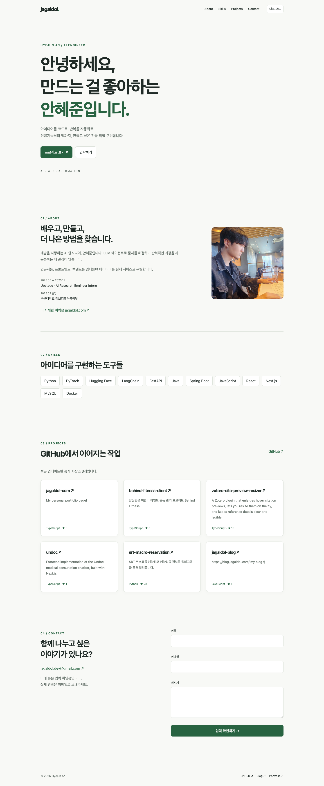
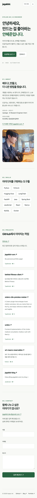
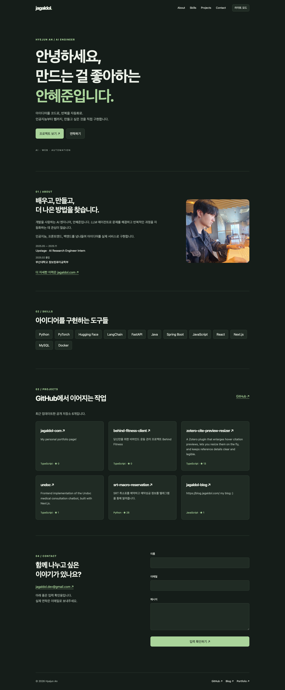

# 안혜준 포트폴리오

HTML, CSS, JavaScript로 만든 반응형 자기소개 페이지입니다. Projects는 `jagaldol` 계정의 최근 업데이트된 공개 저장소 최대 6개를 GitHub API로 표시합니다.

## 실행

빌드나 패키지 설치가 필요 없습니다.

1. VS Code에서 프로젝트 폴더를 엽니다.
2. 추천 확장인 **Live Server**를 설치합니다.
3. `index.html`을 우클릭하고 **Open with Live Server**를 선택합니다.

Python 3가 있다면 아래 명령으로도 확인할 수 있습니다.

```sh
python3 -m http.server 5500 --bind 127.0.0.1
```

브라우저에서 <http://127.0.0.1:5500>에 접속합니다.

## 구성과 동작

- `index.html`: Hero, About, Skills, Projects, Contact, Footer와 시맨틱 마크업
- `css/style.css`: CSS 변수, Flexbox 네비게이션, Grid 카드, 모바일 퍼스트 레이아웃
- `js/main.js`: DOM 이벤트, 테마·API·폼 상태 갱신
- `images/profile.png`: 프로필 이미지

768px부터 데스크톱 메뉴와 2열 소개·문의 영역을 사용하고, 1024px부터 섹션 간격을 넓힙니다. 모바일에서는 햄버거 메뉴를 사용합니다.

스크롤 **60px**부터 네비게이션 배경이 바뀌고, **300px**부터 맨 위로 이동하는 버튼이 표시됩니다. 앵커 이동은 부드러운 스크롤을 사용합니다. 스크롤 등장 애니메이션은 Intersection Observer의 **threshold 0.2**를 사용하며, 동작 줄이기 설정에서는 애니메이션을 생략합니다.

| 이벤트 | 상태 변경 | 화면 갱신 |
| --- | --- | --- |
| 테마 버튼 클릭 | `theme` 변경, localStorage 저장 | 색상과 버튼 문구 변경, 새로고침 후 유지 |
| API 요청·재시도 | `projects.status` 변경 | 로딩, 카드, 에러와 재시도 버튼, 빈 상태 표시 |
| 폼 입력·제출 | 필드별 `errors` 변경 | 인접 오류 메시지·유효성 속성·성공 메시지 표시 |

문의 폼은 이름·이메일·메시지의 필수값과 이메일 형식을 검증합니다. 성공 시 입력 확인 메시지만 표시하며 **이메일을 전송하거나 입력 내용을 저장하지 않습니다.** 실제 연락은 이메일 링크를 사용합니다.

GitHub API는 인증 없이 사용하며 시간당 60회 제한이 있습니다. HTTP 403과 네트워크 실패는 에러 상태로 표시하고 수동 재시도를 제공합니다. Skills의 React 등은 보유 기술 목록이며, 이 페이지 자체에는 외부 라이브러리를 사용하지 않습니다.

## 검증

Chrome에서 실제 API 응답과 성공·로딩·빈 응답·403·네트워크 실패 테스트 응답을 확인했습니다. 폼의 빈값·공백·잘못된 이메일·정상 입력, 테마 저장, 모바일 메뉴, 스크롤, 375/768/1024/1440px의 가로 넘침을 검증했습니다. [검증 결과](docs/evidence/browser-check.md)

## 배포

현재 GitHub Pages에는 배포하지 않았습니다. 구현을 `main`에 push한 뒤 저장소의 **Settings → Pages → Deploy from a branch → main / (root)**를 선택하면 됩니다.

배포 후 확인할 주소: <https://jagaldol-codyssey.github.io/codyssey-portfolio/>

## 화면

로컬 서버에서 실제 GitHub API 응답으로 촬영한 화면입니다.

### 데스크톱



### 모바일



### 다크 모드


